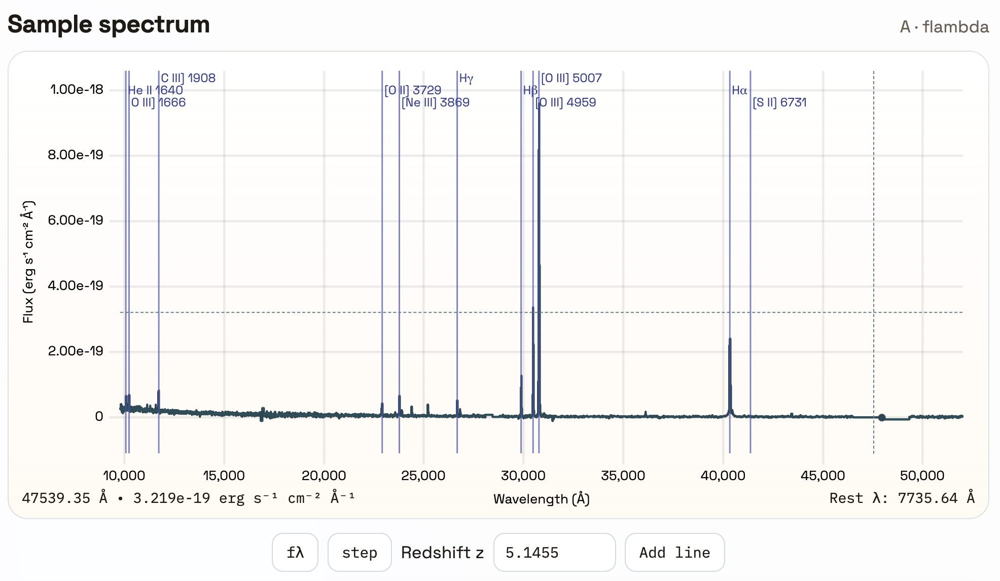

# USpec

USpec is a Vue 3 + Vite web app for interactively exploring astronomical spectra. Load one or more CSV spectra, switch between fλ / fν, add or hide spectral lines, and tune redshift with shift-drag. Alt/Option hides line overlays to declutter the view.



## Quick start
```bash
npm install
npm run dev
```
Open the printed local URL to use the app. For a production build:
```bash
npm run build
npm run preview
```

Live preview: https://preview.lmytime.com/uspec/

## Features
- CSV upload (multi-file) with drag-and-drop
- Unit handling for wavelength and flux, fλ/fν toggle, step/line toggle
- Redshift tools (numeric input, shift+drag to adjust), per-file z and units persisted in memory
- Spectral line overlays with grouped, collapsible controls (editable via `public/astro_lines.json`)
- Cursor readouts for observed and rest-frame wavelength
- Relative asset paths for portable builds

## Notes
- Default sample spectrum uses z=5.1455; uploaded files default to z=2.3456.
- Closing the page prompts a warning to avoid losing unsaved state.
- This is a test build; minor bugs may exist while iterating.

## License
MIT
